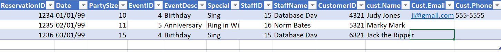
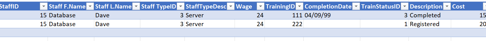

# Lab 1 Tyson Denis DMIT-1508 A02

Hey Don, Tyson Denis here. I worked on the lab on Friday the 26th and Tuesday 30th, but then I did the practice labs JoesVideos and Memories forever and realized I wssn't following the normalization rules. For example, in my first lab I removed the customer info from the intital table because I recognized the pattern. I'm not sure if thats what you are asking for so I started it again. I will try to follow the normalization rules exactly and I will document my thought process just as in my first attempt.

## Reservation View

### Initial Table (attribute list only)

ReservationId, Date, PartySize, (EventId, EventDescription), SpecialAccomodations, (StaffId, Name), CustomerId, Name, Phone, Email

So, in order to visualize potential repeating groups I made a couple dummy entries into the table in this form.

.

I have identified EventId and EventDescription as a repeating group and StaffId and StaffName as a repeating group. So I will copy the repeating groups to a new table and mark keys and do the cardinality.

### 1NF

All attributes atomic and no repeating groups.

ReservationID(PK),EventID(FK), StaffID(FK), Date, PartySize, Special Accommodations, CustomerID, CustomerFirstName,CustomerLastName, CustomerPhone, CustomerEmail

EventID(PK), EventDescription

StaffId(PK), StaffFirstName, StaffLastName

### 2NF

No partial dependency allowed. We do not have a composite key in these tables but I can see customer information sticking out. But because customer ID is not a key I'll leave it there until 3NF

ReservationID(PK),EventID(FK), StaffID(FK), Date, PartySize, Special Accommodations, CustomerID, CustomerFirstName,CustomerLastName, CustomerPhone, CustomerEmail

EventID(PK), EventDescription

StaffId(PK), StaffFirstName, StaffLastName

### 3NF

No transitive dependencies allowed. nonkey attributes can fully depend on each other.

Does CustomerFirstName, CustomerPhone, depend on another non-key attribute? yes they depend on customer ID. So I will take those out of there.

ReservationID(PK),EventID(FK), StaffID(FK), Date, PartySize, Special Accommodations,CustomerID(FK)

CustomerID(PK), CustomerFirstName,CustomerLastName, CustomerPhone, CustomerEmail

EventID(PK), EventDescription

StaffId(PK), StaffFirstName, StaffLastName

Everything here has cardinality to the reservation table.
Customer to reservation = a reservation must have a customer, but a customer can have zero one or many reservations.

Event to reservation = a reservation can have one and only one event, but an event can appear on zero one or many reservations 

Staff to reservation = a reservation can have one and only one staff, but a staff can work on zero one or many reservation instances. 

## Staff Training Status 

Staff Training Status View

Ok so we need to keep in mind the purpose of this record. To record staff training status efficiently.
### Initial Table (attribute list only)

Candidate primary key will be StaffID. So we can search their training status using ID.

StaffId, (Name, StaffTypeId, StaffTypeDescription, Wage), TrainingId, CompletionDate, (TrainingStatusId, Description), Cost

So again I made a table in this form to help me identify repeating groups. I think I have found them above. So take them out, designate primary key and flag it as a foreign key in the new table.

### 1NF

StaffID(PK), TrainingID, CompletionDate,Cost

StaffID(FK PK), Staff F.Name, Staff L.Name, StaffTypeID, StaffTypeDescription, Wage

TrainingStatusID(PK), TrainingStatusDescription

### 2NF
So, we are in 2NF above because we dont have any partial dependencies. TrainingID depends on StaffID of the specific staff taking that training, completion date depends on the if the staffID completed that training. However Cost depends on the trainingID but that is a transitive dependency. 

### 3NF